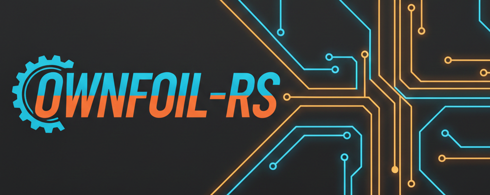

# ownfoil-rs

A self-hosted Nintendo Switch library and game shop, written in Rust, with a
**built-in Web UI**. Browse and manage your collection from a browser, then connect
Tinfoil, Aerofoil/CyberFoil, or Sphaira to download games.



## What you can do

- **Manage everything in your browser:** browse and filter your library, edit
  metadata, manage users and settings, and monitor background tasks and statistics.
- **Keep your collection organized:** scan multiple libraries, watch for new files,
  preview file organization, and clean up old updates.
- **Track what you own:** TitleDB metadata, artwork, available updates and DLC,
  missing content, and collection completeness.
- **Serve your shop:** public or private access, separate user permissions,
  encrypted Tinfoil shops, and resumable downloads.
- **Work with NSP, NSZ, XCI, and XCZ:** identify content, compress or decompress
  files, and verify signatures and hashes using your console keys.
- **Bring an existing Ownfoil setup:** compatible YAML settings, Docker volume
  layout, and database migration. GraphQL is available for integrations.

## Quick start · Docker Compose

From a checkout of this repository:

1. Copy the configuration template:

   ```sh
   cp .env.example .env
   ```

2. Edit `.env`: set `GAMES_PATH` to your library's absolute path. For direct
   access over plain HTTP, uncomment `OWNFOIL_INSECURE_ADMIN_COOKIE=true`;
   leave it unset when using HTTPS.
3. Start the server:

   ```sh
   docker compose up --build -d
   ```

4. Open **[http://localhost:8465](http://localhost:8465)**, or
   `http://<server-ip>:8465` from another device. Create your first administrator
   and manage your library in the Web UI.
5. Open **Setup** (`/setup`) for client connection instructions. Upload your
   console keys in **Settings** when using content identification, verification,
   or conversion.

Configuration and database/cache persist in `./config` and `./data`. Keep both
when upgrading. The library is writable for uploads and organization; set
`GAMES_MOUNT_MODE=ro` in `.env` for serving only. See [.env.example](.env.example)
for port, directory, and first-start administrator options.

View logs with `docker compose logs -f ownfoil`; stop with `docker compose down`.

## Other ways to run

- **Native:** Rust 1.92+ and a C toolchain are required. For local HTTP access:

  ```sh
  OWNFOIL_INSECURE_ADMIN_COOKIE=true cargo run --release -p ownfoil-rs -- \
    --bind 0.0.0.0:8465 --library-folder ./library \
    --settings ./config/settings.yaml
  ```

  Open the same Web UI on port `8465`. Native data lives in `./data`.
- **ARM boards:** [builds, containers, systemd, and small-board settings](docs/ARM.md).
- **Kubernetes:** [Helm chart](chart/) and [deployment values](chart/values.yaml).

## Project status & contributing

Rust port of [Ownfoil](https://github.com/a1ex4/ownfoil), targeting v2.4.1 parity.
Full parity and validation on all supported clients are still in progress. See
[roadmap](ROADMAP.md), [known differences](ownfoil-rs/PARITY_NOTES.md), and
[validation results](ownfoil-rs/VALIDATION.md).

Before submitting a change:

```sh
cargo fmt --all -- --check
cargo clippy --workspace --all-targets --locked -- -D warnings
cargo test --workspace --all-targets --locked
```

Optional: `./scripts/setup-hooks.sh` enables repository pre-push checks.

## License & credits

Based on Ownfoil by [a1ex4](https://github.com/a1ex4/ownfoil). See the
[project license](ownfoil-rs/LICENSE) and [third-party notices](ownfoil-rs/third_party/README.md).
